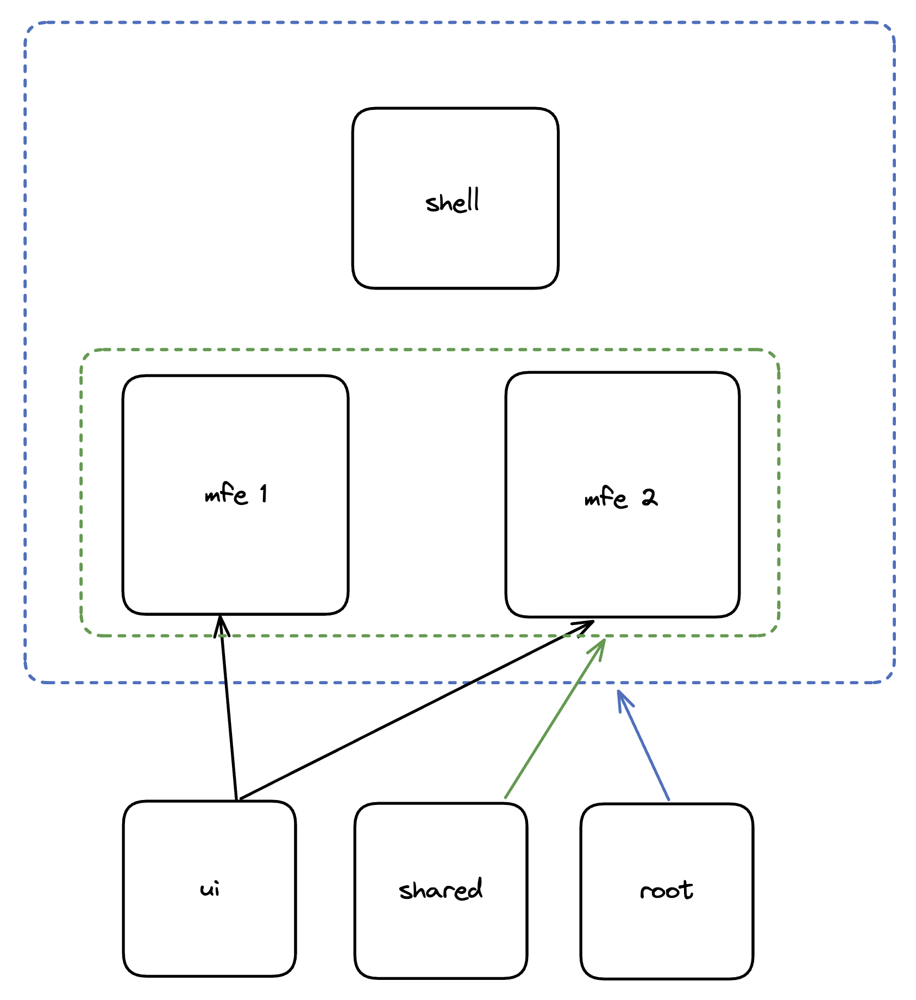

# Архитектура микрофронтендов

## Микросервисная архитектура

Микросервисная архитектура - это подход к разработке программного обеспечения, при котором большое приложение
разбивается на небольшие автономные сервисы, каждый из которых может работать в отдельном процессе или контейнере, и
взаимодействовать с другими сервисами по определенным протоколам.

## Архитектура микрофронтенд приложений

Архитектура микрофронтенд приложений представляет из себя микросервисную архитектуру, адаптированную под фронтенд
приложения. Она предполагает разделение фронтенда на более мелкие автономные части - микрофронтенды. Каждый
микрофронтенд может быть разработан, тестирован и развернут независимо от других микрофронтендов.

Основные компоненты архитектуры микрофронтенд приложений включают:

- Микрофронтенды: это автономные части фронтенда, которые могут быть разработаны с использованием разных технологий и
  фреймворков. Каждый микрофронтенд отвечает за определенную функциональность и может быть разработан, тестирован и
  развернут независимо от других микрофронтендов.

- Шлюз приложения: это единая точка входа для пользователя, которая отвечает за координацию запросов между
  микрофронтендами и предоставляет общий интерфейс для взаимодействия с пользователем. Шлюз приложения может выполнять
  функции, такие как управление аутентификацией и авторизацией, управление сессиями, маршрутизация между
  микрофронтендами и другие.

- Коммуникационный протокол: это способ взаимодействия между микрофронтендами. Коммуникационный протокол может быть
  реализован с помощью различных технологий, таких как API, событийная модель, потоковая передача данных и т.д.

- Общие библиотеки: это компоненты, которые могут быть переиспользованы между различными микрофронтендами. Общие
  библиотеки могут содержать код для работы с API, компоненты пользовательского интерфейса, утилиты и другие компоненты.

## Преимущества и недостатки использования микрофронтедов

Использование микрофронтендов также может иметь следующие преимущества и недостатки:

**Преимущества**

- **Гибкость**: Микрофронтенды позволяют создавать независимые части фронтенда, которые могут разрабатываться и
  развертываться отдельно друг от друга. Это облегчает поддержку и управление приложением.

- **Масштабируемость**: каждый микрофронтенд может масштабироваться независимо от других частей приложения, что позволяет
  легко расширять функциональность и улучшать производительность.

- **Переиспользуемость**: компоненты микрофронтендов можно переиспользовать в различных проектах, что экономит время и
  средства на разработку новых компонентов.

- **Независимость**: каждый микрофронтенд может использовать свои собственные технологии и инструменты, что позволяет
  выбирать наиболее подходящие для конкретного компонента средства разработки.

- **Изолированность**: если один микрофронтенд не работает должным образом, это не повлияет на работу приложения в целом.

- **Публикация в реальном времени**: микрофронтенды могут быть обновлены и опубликованы без остановки работы всего
  приложения, что позволяет более быстро внедрять изменения и улучшения.

- **Уменьшение time to market**: использование микрофронтендов может помочь компаниям ускорить время до момента выхода на
  рынок и обеспечить быстрое развитие и модернизацию приложения в будущем.

- **Ускорение ci/cd**: Уменьшение времени прохождения пайплайнов обеспечивается за счет уменьшения компонентов сборки

- Уменьшение использования **фича-флагов**

**Недостатки**

- **Сложность инфраструктуры**: Архитектура микрофронтендов требует наличия сложной инфраструктуры и технического стека, что
  может привести к дополнительным затратам на разработку и поддержку приложения.

- **Управление версиями**: Каждый микрофронтенд может использовать свои собственные версии библиотек и зависимостей, что
  может привести к проблемам совместимости и стабильности приложения.

## Простой пример архитектуры микрофронтенд-приложения

## Инструменты для реализации

- iframe

- Single SPA

- Модульные библиотеки

- Module Federation (Webpack 5)
